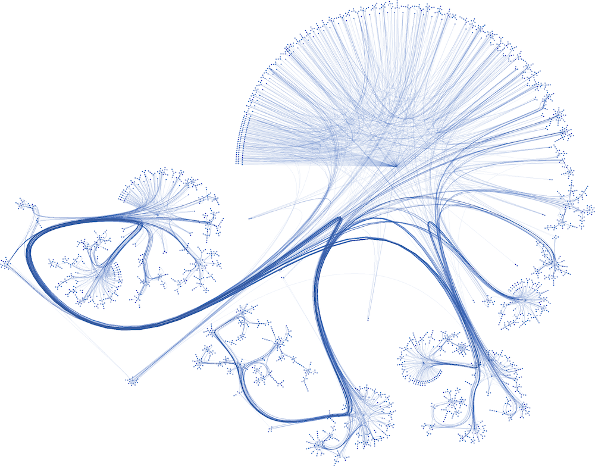

Cora Publication Prediction using Graph Convolutional Networks (GCN)
====================================================================

Graph Neural Networks (GNNs) are specially designed to understand and learn from data organized in graphs, 
making them incredibly versatile and powerful. Graph Convolutional Networks (GCNs) is a widely adopted
model which makes use of both node features and local connections.

In this introductory tutorial, you will be able to 

1. Build a GCN model using STGraph's neural network layers.
2. Load the Cora dataset provided by STGraph.
3. Train and evaluate the GCN model for node classification task on the GPU.

The Task At Hand
----------------

The Cora dataset is a widely used citation network for benchmarking graph-based machine learning algorithms.
It comprises and captures the relationship between 2708 scientific publications classified into one of seven classes, 
where nodes represent individual papers, and edges denote citation links between them. The network comprises of 
5,429 connections. Each publication in the dataset is characterized by a binary word vector (0 or 1), 
signifying the non-existence or existence of the respective word from a dictionary of 1,433 unique words.

Our task is to train a GCN model on the Cora dataset and predict the topic of a publication (node) by considering 
the neighboring node information and the overall graph structure. Or in other words, Node Classification.

   Cora Dataset Visualized [1]

.. note::

    This tutorial does not cover the detailed mechanics of how or why a GCN layer works.We
    will only focus on using the GCN layer provided by STGraph to create a trainable multi-layer GCN model for node classification
    on the Cora dataset. To learn more about GCN layers, refer to the following resources:

    1. `Semi-Supervised Classification with Graph Convolutional Networks <https://arxiv.org/abs/1609.02907>`_
    2. `Graph Convolutional Networks (GCNs) made simple <https://youtu.be/2KRAOZIULzw?si=Ryc74igSJ-zVMhjf>`_

Code File Structure
-------------------

We will structure our tutorial with the following 4 files:

.. code-block:: python

    ├── main.py
    ├── model.py
    ├── train.py
    └── utils.py

Writing the GCN model
---------------------

Let's start by building our GCN model within a file named ``model.py``. First, import all the required modules. We will use PyTorch as our backend framework,
along with the :class:`GCNConv <stgraph.nn.pytorch.static.gcn_conv.GCNConv>` layer from STGraph, which is designed for the PyTorch backend.

.. code-block:: python

    # model.py

    import torch.nn as nn
    import torch.nn.functional as F

    from stgraph.nn.pytorch.static.gcn_conv import GCNConv

Our main component is the GCN class, which represents the Graph Convolutional Network we will train. Here’s the code to initialize the GCN object

.. code-block:: python

    # model.py

    class GCN(nn.Module):
        def __init__(
            self,
            graph,
            in_feats: int,
            n_hidden: int,
            n_classes: int,
            n_hidden_layers: int,
        ) -> None:
            super(GCN, self).__init__()

            self._graph = graph
            self._layers = nn.ModuleList()

            # input layer
            self._layers.append(GCNConv(in_feats, n_hidden, F.relu, bias=True))

            # hidden layers
            for i in range(n_hidden_layers):
                self._layers.append(GCNConv(n_hidden, n_hidden, F.relu, bias=True))

            # output layer
            self._layers.append(GCNConv(n_hidden, n_classes, None, bias=True))

First, let's review all the arguments passed to the initialization method

1. **graph**: This should be an STGraph graph object representing our graph dataset. For our tutorial, the Cora dataset will be of type :class:`StaticGraph <stgraph.graph.static.static_graph.StaticGraph>`.
2. **in_feats**: The size of node features, which would equal the number of neurons in the input layer of our GCN architecture.
3. **n_hidden**: The number of neurons in each hidden layer. We assume all hidden layers have the same number of neurons.
4. **n_classes**: The number of classes each node in the Cora dataset can be classified into. It also corresponds to the number of neurons in the output layer of our GCN architecture.
5. **n_hidden_layers**: The number of hidden layers present in the GCN architecture.

We will initialize a list to hold all the layers of our GCN model. Using ``nn.ModuleList()`` allows for easier management of these layers. To this list,
we will append ``GraphConv`` layers for the input layer, all the hidden layers, and then the output layer. The in_channel for the input layer equals to the
size of a single node feature list and the out_channel for the output layer equals to the number of classes we are trying to classify the nodes into.
Note that we use an element-wise ReLU activation function only for the input and hidden layers.

By setting the bias argument to true, we are associating a learnable bias parameter with the input, hidden and output layers.

Next up we can add the ``forward`` method inside the GCN class. When given the node feature as input to the network, it returns the corresponding output activations
by following the feedforward mechanism described for a GCN layer.

.. code-block:: python

    # model.py

    def forward(self, features):
        h = features
        for layer in self._layers:
            h = layer.forward(self._graph, h)
        return h

Preparing the Training Script
-----------------------------

Now that we have defined our GCN model, we can now prepare the training script to train our model on the Cora dataset. You can go ahead and import all the
necessary modules first.

.. code-block:: python

    # train.py

    import traceback

    import torch
    import torch.nn.functional as F

    from stgraph.benchmark_tools.table import BenchmarkTable
    from stgraph.dataset import CoraDataLoader
    from stgraph.graph.static.static_graph import StaticGraph
    from model import GCN
    from utils import (
        accuracy,
        generate_test_mask,
        generate_train_mask,
        row_normalize_feature,
        get_node_norms,
    )

You would notice that we haven't defined any of the imported methods from ``utils``. We will write down the logic for each one of them as we progress through writing the training script.

Loading the Cora Graph Data
^^^^^^^^^^^^^^^^^^^^^^^^^^^

Let's define our ``train`` method first

.. code-block:: python

    # train.py

    def train(lr, num_epochs, num_hidden, num_hidden_layers, weight_decay):
        if not torch.cuda.is_available():
            print("CUDA is not available")
            exit(1)

We are passing the following hyperparameters as arguments to ``train``

1. **lr**: The learning rate for the model.
2. **num_epochs**: Number of epochs to train the model for.
3. **num_hidden**: Number of neurons in each hidden layer.
4. **num_hidden_layers**: Count of hidden layers.
5. **weight_decay**: Weight decay value for L2 regularization to avoid overfitting

As soon as we enter the ``train`` function, we are checking whether CUDA is available on the system. If it is not available, then we exit from the program.
STGraph requires CUDA to be present for it to train any model.

Next up we load our Cora dataset and all the necessary features, labels and weights. Once loaded into CPU, they are finally moved into the GPU using the ``.cuda()`` method.

.. code-block:: python

    # train.py

        cora = CoraDataLoader()

        node_features = row_normalize_feature(
            torch.FloatTensor(cora.get_all_features())
        )
        node_labels = torch.LongTensor(cora.get_all_targets())
        edge_weights = [1 for _ in range(cora.gdata["num_edges"])]

        train_mask = torch.BoolTensor(
            generate_train_mask(cora.gdata["num_nodes"], 0.7)
        )
        test_mask = torch.BoolTensor(
            generate_test_mask(cora.gdata["num_nodes"], 0.7)
        )

        torch.cuda.set_device(0)
        node_features = node_features.cuda()
        node_labels = node_labels.cuda()
        train_mask = train_mask.cuda()
        test_mask = test_mask.cuda()

The node features are row-normalised as shown below

.. code-block:: python

    # utils.py

    def row_normalize_feature(features):
        row_sum = features.sum(dim=1, keepdim=True)
        r_inv = torch.where(row_sum != 0, 1.0 / row_sum, torch.zeros_like(row_sum))
        norm_features = features * r_inv

        return norm_features

We are considering that the edge-weight is 1 for all edges. The ``train_mask`` and ``test_mask`` can be generated using the following two helper functions. We are taking the test-train
split to be 0.7, but you can experiment with different values.

.. code-block:: python

    # utils.py

    def generate_train_mask(size, train_test_split):
        cutoff = size * train_test_split
        return [1 if i < cutoff else 0 for i in range(size)]

    def generate_test_mask(size, train_test_split):
        cutoff = size * train_test_split
        return [0 if i < cutoff else 1 for i in range(size)]

Creating STGraph Graph Object and GCN Model
^^^^^^^^^^^^^^^^^^^^^^^^^^^^^^^^^^^^^^^^^^^

We need to create a :class:`StaticGraph <stgraph.graph.static.static_graph.StaticGraph>` object representing our Cora dataset, which can then be passed to our GCN model.

.. code-block:: python

    # train.py

    cora_graph = StaticGraph(
        edge_list=cora.get_edges(),
        edge_weights=edge_weights,
        num_nodes=cora.gdata["num_nodes"]
    )

    cora_graph.set_ndata("norm", get_node_norms(cora_graph))

The node-wise normalization ``norm`` is set as node meta-data. This is internally used by the :class:`GCNConv <stgraph.nn.pytorch.static.gcn_conv.GCNConv>` layer while aggregating the
features of a nodes neighbours. We calculate the node-wise normalization as follows

.. code-block:: python

    # utils.py

    def get_node_norms(graph: StaticGraph):
        degrees = torch.from_numpy(graph.weighted_in_degrees()).type(torch.int32)
        norm = torch.pow(degrees, -0.5)
        norm[torch.isinf(norm)] = 0
        return to_default_device(norm).unsqueeze(1)

We can go ahead and now load up the GCN model we created earlier into the GPU using ``.cuda()``. Follow it up by using Cross Entropy Loss and Adam as the loss function and optimizer respectively.

.. code-block:: python

    # train.py

        model = GCN(
            graph=cora_graph,
            in_feats=cora.gdata["num_feats"],
            n_hidden=num_hidden,
            n_classes=cora.gdata["num_classes"],
            n_hidden_layers=num_hidden_layers
        ).cuda()

        loss_function = F.cross_entropy
        optimizer = torch.optim.Adam(
            model.parameters(), lr=lr, weight_decay=weight_decay
        )

Training the GCN Model
^^^^^^^^^^^^^^^^^^^^^^

To help visualize various metrics such as accuracy, loss, etc. during training, we can use the :class:`BenchmarkTable <stgraph.benchmark_tools.table.BenchmarkTable>` present in the STGraph utility package.

.. code-block:: python

    # train.py

    table = BenchmarkTable(
        f"STGraph GCN on CORA dataset",
        ["Epoch", "Train Accuracy %", "Loss"],
    )

Here is the entire training block

.. code-block:: python

    # train.py

        try:
            print("Started Training")
            for epoch in range(num_epochs):
                model.train()
                torch.cuda.synchronize()

                logits = model.forward(node_features)
                loss = loss_function(logits[train_mask], node_labels[train_mask])
                optimizer.zero_grad()
                loss.backward()
                optimizer.step()

                torch.cuda.synchronize()

                train_acc = accuracy(logits[train_mask], node_labels[train_mask])

                table.add_row(
                    [epoch, float(f"{train_acc * 100:.2f}"), float(f"{loss.item():.5f}")]
                )
            print("Training Ended")
            table.display()

            print("Evaluating trained GCN model on the Test Set")

            model.eval()
            logits_test = model(node_features)
            loss_test = loss_function(logits_test[train_mask], node_labels[train_mask])
            test_acc = accuracy(logits_test[test_mask], node_labels[test_mask])

            print(f"Loss for Test: {loss_test}")
            print(f"Accuracy for Test: {float(test_acc) * 100} %")

        except Exception as e:
            print("------------- Error -------------")
            print(e)
            traceback.print_exc()

For each epoch, we are doing the following

1. Running a single forward pass with ``node_features`` as input and ``logits`` as output.
2. Calculating the loss using the Cross Entropy Loss function.
3. Reset the gradients of all the parameters that the optimizer is managing using ``optimizer.zero_grad()``.
4. Perform backpropagation using ``loss.backward()``.
5. Update the parameters with ``optimizer.step()``.
6. Calculate the training accuracy.
7. Add necessary information to be displayed in the table.

Training accuracy is calculated as follows

.. code-block:: python

    # utils.py

    def accuracy(logits, labels):
        _, indices = torch.max(logits, dim=1)
        correct = torch.sum(indices == labels)
        return correct.item() * 1.0 / len(labels)

Finally we evaluate the model on the test set and report the accuracy and loss.

The main.py File
^^^^^^^^^^^^^^^^

Let's prepare a ``main.py`` which accepts the hyperparameters as command-line arguments and invokes the ``train`` method.

.. code-block:: python

    # main.py

    import argparse

    from train import train

    def main(args) -> None:
        train(
            lr=args.learning_rate,
            num_epochs=args.epochs,
            num_hidden=args.num_hidden,
            num_hidden_layers=args.num_hidden_layers,
            weight_decay=args.weight_decay,
        )

    if __name__ == "__main__":
        parser = argparse.ArgumentParser(description="Training GCN on CORA Dataset")

        parser.add_argument(
            "-lr",
            "--learning-rate",
            type=float,
            default=0.01,
            help="Learning Rate for the GCN Model",
        )

        parser.add_argument(
            "-e",
            "--epochs",
            type=int,
            default=200,
            help="Number of Epochs to Train the GCN Model",
        )

        parser.add_argument(
            "-n",
            "--num-hidden",
            type=int,
            default=16,
            help="Number of Neurons in Hidden Layers",
        )

        parser.add_argument(
            "-l", "--num-hidden-layers", type=int, default=1, help="Number of Hidden Layers"
        )

        parser.add_argument(
            "-w", "--weight-decay", type=float, default=5e-4, help="Weight Decay"
        )

        args = parser.parse_args()
        main(args=args)

Let's go ahead and train our GCN model! Run this command to train a GCN model with our default hyperparameters

1. Learning rate set to 0.01
2. 200 Epochs
3. 16 neurons in the hidden layers
4. 1 hidden layer
5. Weight decay of 0.0005

.. code-block:: bash

    $ python3 main.py

Here is a truncated output

.. code-block:: bash

    Started Training
    Training Ended

        STGraph GCN on CORA dataset

     Epoch ┃ Train Accuracy % ┃ Loss
    ━━━━━━━╇━━━━━━━━━━━━━━━━━━╇━━━━━━━━━
     0     │ 14.98            │ 1.94579
     1     │ 27.74            │ 1.93584
     2     │ 27.74            │ 1.92458
     3     │ 27.74            │ 1.91228
     4     │ 27.74            │ 1.89956
     5     │ 27.74            │ 1.88697
     .
     .
     .
     195   │ 76.27            │ 0.6078
     196   │ 76.16            │ 0.60734
     197   │ 76.37            │ 0.60676
     198   │ 76.16            │ 0.60579
     199   │ 76.32            │ 0.60465

    Evaluating trained GCN model on the Test Set
    Loss for Test: 0.6035217642784119
    Accuracy for Test: 75.1231527093596 %

We are achieving a training accuracy of around 76% and testing accuracy of 75%. This is pretty good for our first attempt.

Exercises
---------

STGraph users need not stop here and can try out the following exercises to try to make the model learn better

1. In the tutorial we are splitting the dataset only into a training set and testing set. Try creating a validation set as well to tune and optimize the hyperparameters.
2. Try changing the number of hidden layers and number of hidden layer neurons. Maybe use no hidden layer at all. Do you notice any form of improvement? Or does it make the model worse?
3. We did not use any activation function in the output layer. Try finding some common activation functions that can be used in the output layer for classification tasks and modify the GCN model.