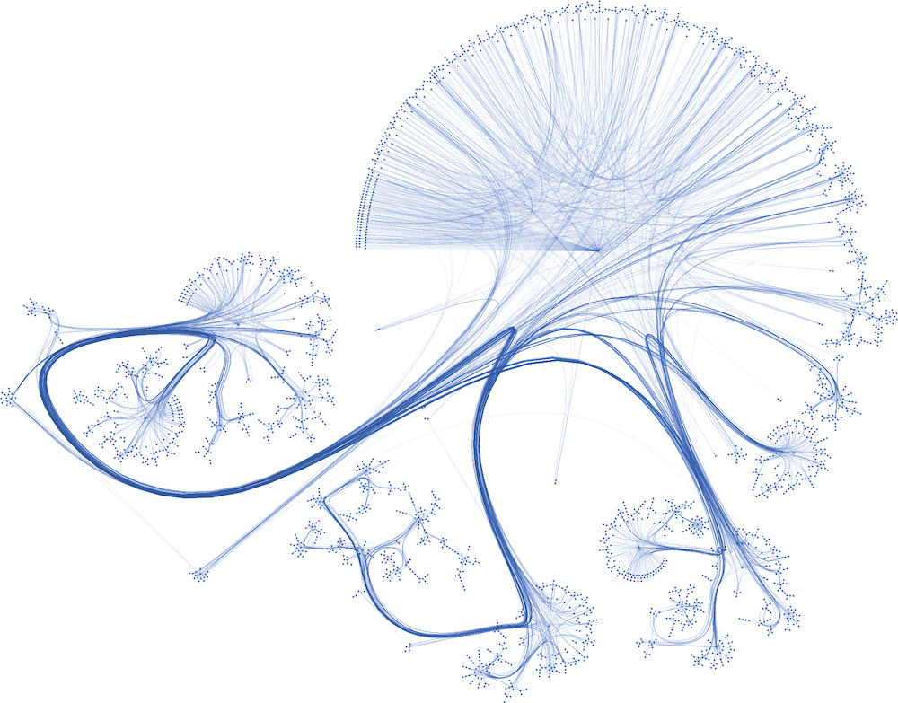

Training a GCN on the Cora dataset
==================================

Graph Neural Networks (GNNs) are specially designed to understand and learn from data organized in graphs, 
making them incredibly versatile and powerful. Graph Convolutional Networks (GCNs) is a widely adopted
model which makes use of both node features and local connections.

In this introductory tutorial, you will be able to 

1. Build a GCN model using STGraph's neural network layers.
2. Load the Cora dataset provided by STGraph.
3. Train and evaluate the GCN model for node classification task on the GPU.

The task at hand
----------------

The Cora dataset is a widely used citation network for benchmarking graph-based machine learning algorithms.
It comprises and captures the relationship between 2708 scientific publications classified into one of seven classes, 
where nodes represent individual papers, and edges denote citation links between them. The network comprises of 
5,429 connections. Each publication in the dataset is characterized by a binary word vector (0 or 1), 
signifying the non-existence or existence of the respective word from a dictionary of 1,433 unique words.

Our task is to train a GCN model on the Cora dataset and predict the topic of a publication (node) by considering 
the neighboring node information and the overall graph structure. Or in other words, Node Classification.

   Cora Dataset Visualized [1]

Writing the GCN model
---------------------

Let's begin by creating our GCN model inside a file named ``model.py``.

.. code-block:: python
    :linenos:

    import torch.nn as nn
    from stgraph.nn.pytorch.graph_conv import GraphConv

    class GCN(nn.Module):
        def __init__(self,
                    graph,
                    in_feats,
                    n_hidden,
                    n_classes,
                    n_layers,
                    activation):

            super(GCN, self).__init__()

            self.graph = graph
            self.layers = nn.ModuleList()
            self.layers.append(GraphConv(in_feats, n_hidden, activation))
            
            for i in range(n_layers - 1):
                self.layers.append(GraphConv(n_hidden, n_hidden, activation))
            
            self.layers.append(GraphConv(n_hidden, n_classes, None))

        def forward(self, g, features):
            h = features
            for layer in self.layers:
                h = layer(g, h)
            return h